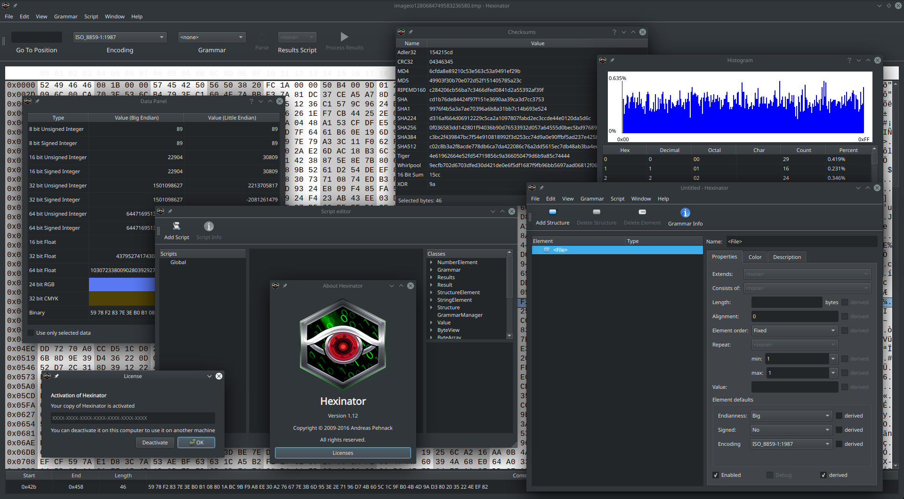
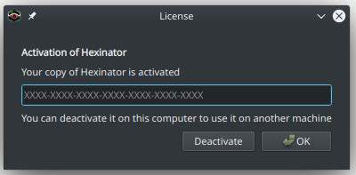

## [CipherHater Hacking Team](https://cipherhater.ga/)


<div style="text-align:center" markdown="1">


</div>


<center>
    <p><b>
        "We do not pay for programs that you do not know how to protect..." &copy; CipherHater
    </b></p>
</center>


 CipherHater Team is a group consisting of highly skilled hackers at different area of experties, capable of bypassing several cyber rules and protocol to get the expected result of any assigned task. Our hackers are technically effiecient enough with finishing up any job prior deadline, providing you with access and proofs of whatever it is that you need. We are well experienced Hackers who have learned diverse skills in simple, complex and critical Hacking jobs. Our guys are experts at what they do and thus handle tasks effieciently maintaining a clean and clear job with no trace leaving behind. Utmostly, we respect the interest of our clients.


<div style="text-align:center" markdown="1">


</div>

## [YOU SHOULD READ THIS BEFORE CONTACTING US](mailto:cipherhater@protonmail.com)

 I and my guys are not one of those cheap ass hackers here on deepweb who are trying to raise peanuts money, we are good with our skills and knowledgable with what we do. we can get job as an ethical hacker from most of the organisations who are looking for hackers with the skills and experience we have and, so if you are interested in contacting us you should also be ready and serious to bring a reasable task and coperate with our terms, we are not just looknig for customers here, but we are looking for serious minded people who need any of their hacking jobs to be done, no matter how hard or complicated thee job might be, we will bleed through it snd make sure we deliver to you on or before the expected day we promised. We came together with our individual skills to archeive a bigger goal of service.

For anyone who is interested in hiring any of the services we provide you can [Send E-Mail](mailto:cipherhater@protonmail.com) we will reply your email as soon as we get it and give you further details on how the job is to be done and the time duration as well that will be required but we make sure we deliver the task done on or before the date of delivery.


# [View all implemented hacks]()

1. <a href="#houdini">Houdini 18.0.391</a>
2. <a href="#hexnator">Hexinator 1.11</a>
3. <a href="#slickedit">SlickEdit 2019 24.0.1.0</a>
4. <a href="#wing">Wing IDE Professional 7.2.1.0</a>
5. <a href="#jriver">JRiver Media Center 26.26.0.37</a>
6. <a href="#seolog">SEO Log File Analyser 3.3</a>
7. <a href="#seospider">Screaming Frog SEO Spider 12.6</a>

----

<a name="houdini" />

## Houdini 18.0.391

**Only for version 18.0.391 and Linux x86_64**

Houdini 18.0 introduces PDG which is designed to enhance SideFX’s procedural architecture to distribute tasks and manage dependencies to better scale, automate, and analyze content pipelines for Film, TV, Games, Advertising and VR. In addition, there have been a number of enhancements to key features such as FLIP Fluids, volumes, destruction tools and more.

[Houdini home site](https://www.sidefx.com/products/houdini/)

License key required: **YES (Available with key generator)**
```
After the patch, the program is fully functional.
```


----

<a name="hexinator" />

## Hexinator 1.11

**Only for version 1.11 and Linux x86_64**

Powerful free Hex Editor for Windows and Linux.

[Hexinator home site](https://hexinator.com/)

License key required: **NO**
```
After the patch, the program is fully functional.
```




----

<a name="slickedit" />

## SlickEdit 2019 24.0.1.0

**Only for version 24.0.1.0 and Linux x86_64**

SlickEdit 2019 is a cross-platform, multi-language code editor that gives programmers the ability to code in over 70 languages on 9 platforms. This latest version builds on the company’s 30 years of experience in enabling developers and development teams to create, navigate, modify, build, and debug code faster and more accurately. SlickEdit 2018 delivers a wide range of powerful new features and existing feature enhancements.

[SlickEdit 2019 home site](https://www.slickedit.com/)

License key required: **YES**
```
After the patch, the program is fully functional.
```


----

<a name="wing" />

<a name="jriver" />

<a name="seolog" />

<a name="seospider" />


----

## [Detailed explanation]()

For anyone who is interested in pay of the this patch we provide you can [Send E-Mail](mailto:cipherhater@protonmail.com) we will reply your email as soon as we get it and give you further details on how the payment is to be done and the amount duration as well that will be required for receiving patch. 

----

## [Access to - Darknet Website / Deep Web Hidden Sites](http://cipherhater.torpress2sarn7xw.onion/)


- [Warning! To access the CipherHater resource, you need the Tor Browser!](https://www.torproject.org/download/)

----

<center>
    <p>
        Copyright &copy; 2019-2020 CipherHater All rights reserved.
    </p>
</center>
