## [CipherHater Hacking Team](https://cipherhater.club/)


<div style="text-align:center" markdown="1">


</div>


 CipherHater Team is a group consisting of highly skilled hackers at different area of experties, capable of bypassing several cyber rules and protocol to get the expected result of any assigned task. Our hackers are technically effiecient enough with finishing up any job prior deadline, providing you with access and proofs of whatever it is that you need. We are well experienced Hackers who have learned diverse skills in simple, complex and critical Hacking jobs. Our guys are experts at what they do and thus handle tasks effieciently maintaining a clean and clear job with no trace leaving behind. Utmostly, we respect the interest of our clients.


<div style="text-align:center" markdown="1">


</div>

## [YOU SHOULD READ THIS BEFORE CONTACTING US](mailto:cipherhater@protonmail.com)

 I and my guys are not one of those cheap ass hackers here on deepweb who are trying to raise peanuts money, we are good with our skills and knowledgable with what we do. we can get job as an ethical hacker from most of the organisations who are looking for hackers with the skills and experience we have and, so if you are interested in contacting us you should also be ready and serious to bring a reasable task and coperate with our terms, we are not just looknig for customers here, but we are looking for serious minded people who need any of their hacking jobs to be done, no matter how hard or complicated thee job might be, we will bleed through it snd make sure we deliver to you on or before the expected day we promised. We came together with our individual skills to archeive a bigger goal of service.

For anyone who is interested in hiring any of the services we provide you can [Send E-Mail](mailto:cipherhater@protonmail.com) we will reply your email as soon as we get it and give you further details on how the job is to be done and the time duration as well that will be required but we make sure we deliver the task done on or before the date of delivery.

**Why is hacking paid?** We do the **PRIMARY hack** – which no one has done yet. After we sell the hacked version it will be perhaps available throughout the public network for free and based on it you can hack versions for Mac and Windows. Now do you understand why this is so? Users who paid for hacking become members of the club and have a subscription for the lifetime of a certain version but do not have the right to distribute new versions on the internet. If a new version is found on the public network, then everyone who has a subscription will lose it without me asking who uploaded it on the warez sites.


# [Wall of shame (list open implemented hacks)](https://en.cryptobadges.io/donate/3PY8prh5RLbuGtyBq4DCvP9xKVw7FZZkuR)

1. <a href="#houdini">Houdini 18.0.566</a>
2. <a href="#maya">Autodesk Maya 2020.1</a>
3. <a href="#mobpro">Autodesk MotionBuilder 20.0.0.37</a>
4. <a href="#indigo">Indigo Renderer 4.2.28/4.4.11</a>
5. <a href="#hexinator">Hexinator 1.12</a>
6. <a href="#slickedit">SlickEdit 2019 24.0.2.0</a>
7. <a href="#wing">Wing IDE Professional 7.2.2.0</a>
8. <a href="#jriver">JRiver Media Center 26.26.0.37</a>
9. <a href="#seolog">SEO Log File Analyser 3.3</a>
10. <a href="#seospider">Screaming Frog SEO Spider 12.6</a>
11. <a href="#turboprint">TurboPrint 2.49-1</a>
12. <a href="#bcad">BricsCAD 20.2.10 and 19.2.15</a>
13. <a href="#textpack">TexturePacker 5.4.0</a>
14. <a href="#sprite">SpriteIlluminator 1.5.4</a>
15. <a href="#physics">PhysicsEditor 1.8.4</a>
16. <a href="#babel">BabelEdit 2.7.1</a>
17. <a href="#after">Corel AfterShot Pro 3 3.6.0.380</a>
18. <a href="#spaint">Substance Painter 2020.2.0</a>
19. <a href="#sdesign">Substance Designer 2020.1.3</a>
20. <a href="#salchem">Substance Alchemist 2020.2.1</a>
21. <a href="#softmaker">SoftMaker Office 2021 build S1018.0818</a>
22. <a href="#masterpdf">Master PDF Editor 5.6.42</a>
23. <a href="#eagle">Autodesk EAGLE Version 9.6.0</a>
24. <a href="#varicad">VariCAD 2020-1.12 (20191119)</a>
25. <a href="#qcad2d">QCAD – 2D CAD Version 3.25</a>
26. <a href="#qcadcam">QCAD/CAM Version 3.25</a>
27. <a href="#sublimetext">Sublime Text 3 3211</a>
28. <a href="#sublimemerge">Sublime Merge 2038</a>
29. <a href="#vuescan">VueScan 9 x64 9.7.46</a>
30. <a href="#flexbv">FlexBV 1150 x64</a>
31. <a href="#serviio">Serviio v2.0</a>
32. <a href="#3dcoat">3DCoat 4.8.20/3DCprinting 1.1.09</a>
33. <a href="#010editor">010 Editor 10.0.2</a>
34. <a href="#mathematica">Wolfram Mathematica 12.1.1</a>

----

## [Detailed explanation](mailto:cipherhater@protonmail.com)

For anyone who is interested in pay of the this patch we provide you can [Send E-Mail](mailto:cipherhater@protonmail.com) we will reply your email as soon as we get it and give you further details on how the payment is to be done and the amount duration as well that will be required for receiving patch. 

----

<a name="houdini" />

## Houdini 18.0.566

**For all version and Linux x86_64**

Houdini 18.0 introduces PDG which is designed to enhance SideFX’s procedural architecture to distribute tasks and manage dependencies to better scale, automate, and analyze content pipelines for Film, TV, Games, Advertising and VR. In addition, there have been a number of enhancements to key features such as FLIP Fluids, volumes, destruction tools and more.

[Houdini home site](https://www.sidefx.com/products/houdini/)

License key required: **YES (Available with key generator)**
```
After the patch, the program is fully functional.
```


----

<a name="maya" />

## Autodesk Maya 2020.1

**Only for version 2020.1 and Linux x86_64**

3D computer animation, modeling, simulation, and rendering software.

[Autodesk Maya home site](https://www.autodesk.com/products/maya/overview)

License key required: **NO**
```
After the patch, the program is fully functional.
```


----

<a name="mobpro" />

## Autodesk MotionBuilder 2020

**Only for version 2020 20.0.0.37 and Linux x86_64**

3D character animation software.

[Autodesk MotionBuilder home site](https://www.autodesk.com/products/motionbuilder/overview)

License key required: **NO**
```
After the patch, the program is fully functional.
```


----

<a name="indigo" />

## Indigo Renderer v4+

**For all version 4.2.28/4.4.11 and Linux x86_64**

Indigo Renderer is an unbiased, photorealistic GPU and CPU renderer aimed at ultimate image quality, by accurately simulating the physics of light. State of the art rendering performance, materials and cameras models - it's all made simple through an interactive, photographic approachwith few abstract settings, letting you concentrate on lighting and composing your imagery.

[Indigo Renderer home site](https://www.indigorenderer.com/)

License key required: **YES (Available with key generator)**
```
After the patch, the program is fully functional.
```


----


<a name="hexinator" />

## Hexinator 1.12

**Only for version 1.12 and Linux x86_64**

Powerful free Hex Editor for Windows and Linux.

[Hexinator home site](https://hexinator.com/)

License key required: **NO**
```
After the patch, the program is fully functional.
```


----

<a name="slickedit" />

## SlickEdit 2019 24.0.2.0

**Only for version 24.0.2.0 and Linux x86_64**

SlickEdit 2019 is a cross-platform, multi-language code editor that gives programmers the ability to code in over 70 languages on 9 platforms. This latest version builds on the company’s 30 years of experience in enabling developers and development teams to create, navigate, modify, build, and debug code faster and more accurately. SlickEdit 2018 delivers a wide range of powerful new features and existing feature enhancements.

[SlickEdit 2019 home site](https://www.slickedit.com/)

License key required: **YES**
```
After the patch, the program is fully functional.
```


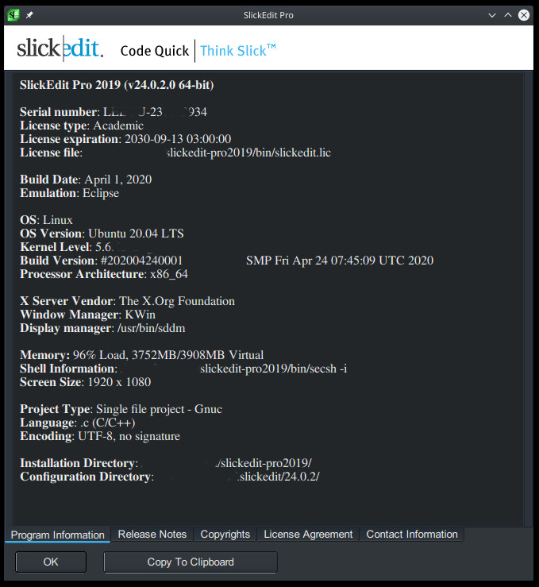

----

<a name="wing" />

## Wing IDE Professional 7.2.2.0

**Only for version 7.2.2.0 and Linux x86_64**

Wing Pro is a full-featured Python IDE designed for professional developers. It includes powerful editing, code intelligence, refactoring, debugging, search, unit testing, project management, revision control, and remote development features. 

[Wing IDE home site](https://www.wingware.com/)

License key required: **YES** (Available with key generator)
```
After the patch, the program is fully functional.
```


----

<a name="jriver" />

## JRiver Media Center 26.26.0.37

**Only for version 26.26.0.37 and Linux x86_64**

JRiver Media Center the most comprehensive and seamless software available for managing and playing your media. Its scope includes almost all formats of audio, video, and images. Media Center can also record television and manage documents. 

[JRiver Media Center home site](https://www.jriver.com/)

License key required: **NO**
```
After the patch, the program is fully functional.
```


----

<a name="seolog" />

## SEO Log File Analyser 3.3

**Only for version 3.3 and Linux x86_64**

The Screaming Frog SEO Log File Analyser allows you to upload your log files, verify search engine bots, identify crawled URLs and analyse search bot data and behaviour for invaluable SEO insight. Download for free, or purchase a licence to upload more log events and create additional projects. 

[SEO Log File Analyser home site](https://www.screamingfrog.co.uk/log-file-analyser/)

License key required: **NO**
```
After the patch, the program is fully functional.
```


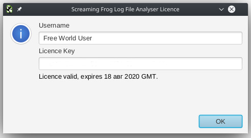

----

<a name="seospider" />

## Frog SEO Spider 12.6

**Only for version 12.6 and Linux x86_64**

The Screaming Frog SEO Spider is a website crawler, that allows you to crawl websites’ URLs to analyse & audit technical & onsite SEO. Download & crawl 500 URLs for free, or buy a licence to remove the crawl limit & access advanced features.

[Frog SEO Spider home site](https://www.screamingfrog.co.uk/seo-spider/)

License key required: **NO**
```
After the patch, the program is fully functional.
```


----

<a name="turboprint" />

## TurboPrint 2.49-1

**Only for version 2.49-1 and Linux x86_64**

TPrint your documents, graphics & photos easily and in professional quality – using the well-proven, award-winning TurboPrint printing system.

[TurboPrint home site](https://www.turboprint.info/)

License key required: **NO**
```
After the patch, the program is fully functional.
```


----

<a name="bcad" />

## BricsCAD 20.2.10 and 19.2.15

**Only for version 20.2.10/19.2.15 and Linux x86_64**

**Communicator version 20.2.01 and Linux x86_64**

BricsCAD is the modern CAD alternative. It is based on DWG, and it is compatible with everything you know. BricsCAD is available as a perpetual license that you can buy once and use forever.

[BricsCAD home site](https://www.bricsys.com/en-intl/)

License key required: **NO**
```
After the patch, the program is fully functional.
```


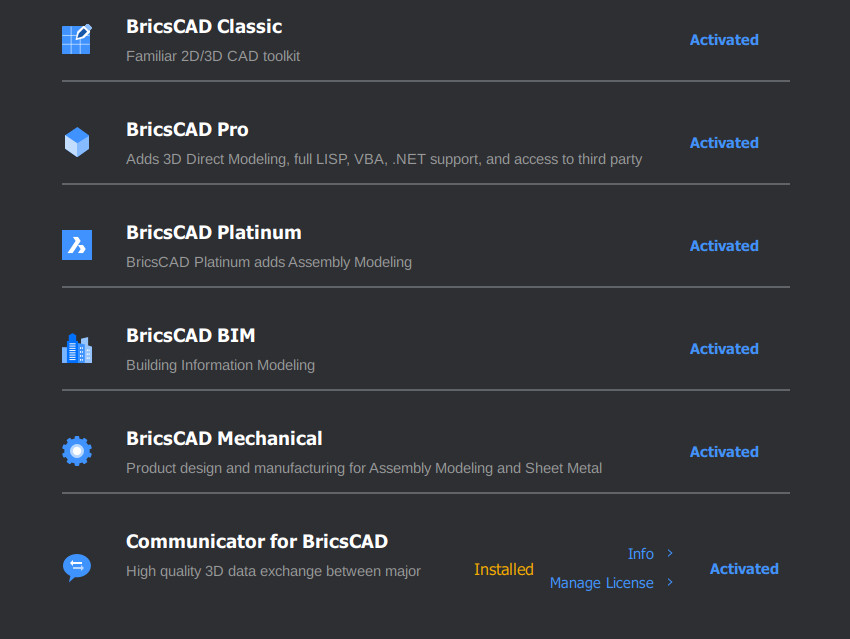


----

<a name="textpack" />

## TexturePacker 5.4.0

**For all version and Linux x86_64**

CREATE OPTIMIZED SPRITE SHEETS

[TexturePacker home site](https://www.codeandweb.com/)

License key required: **NO**
```
After the patch, the program is fully functional.
```

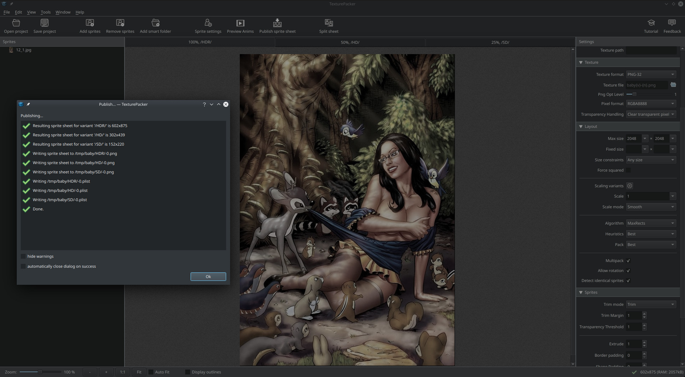
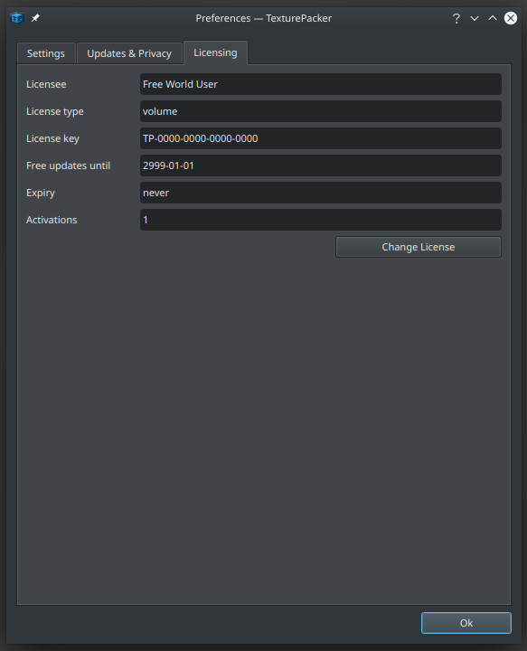


----

<a name="sprite" />

## SpriteIlluminator 1.5.4

**For all version and Linux x86_64**

Normal Map Editor for dynamic lighting and special effects.

[SpriteIlluminator home site](https://www.codeandweb.com/)

License key required: **NO**
```
After the patch, the program is fully functional.
```


----

<a name="physics" />

## PhysicsEditor 1.8.4

**For all version and Linux x86_64**

Physics shape editor for your 2d game project.
Edit 2d collision polygons and physics parameters with ease.

[PhysicsEditor home site](https://www.codeandweb.com/)

License key required: **NO**
```
After the patch, the program is fully functional.
```

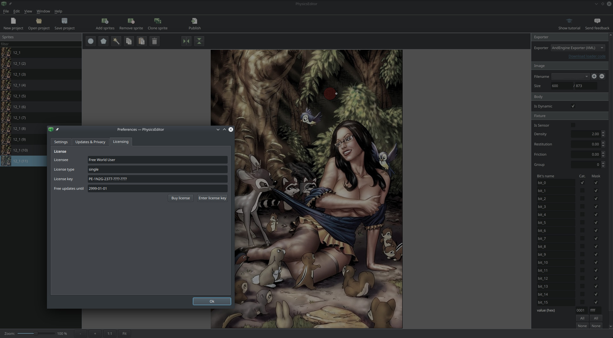


----

<a name="babel" />

## BabelEdit 2.7.1

**For all version and Linux x86_64**

Translation editor for (web) apps.

[BabelEdit home site](https://www.codeandweb.com/)

License key required: **NO**
```
After the patch, the program is fully functional.
```

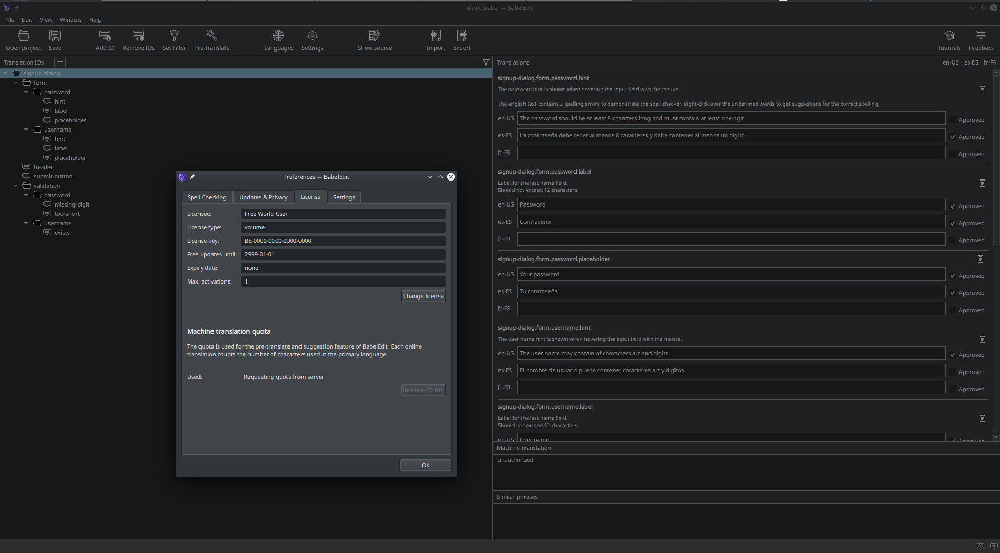


----

<a name="after" />

## Corel AfterShot Pro 3

**Only for version 3.6.0.380 and Linux x86_64**

Corel® AfterShot™ Pro 3 is up to 4x faster than Adobe® Lightroom®*. It's the photo editor that reveals your true creative potential and frees you: from high costs, from endless subscriptions, from hours spent editing at your computer. Import, process and output faster, and get back behind the camera where you belong with AfterShot™ Pro 3.

[Corel AfterShot home site](https://www.aftershotpro.com/en/)

License key required: **NO**
```
After the patch, the program is fully functional.
```


----

<a name="spaint" />

## Substance Painter 2020.2.0

**For all version and Linux x86_64**

All the tools you need to texture your 3D assets in one application.
Substance Painter has smart materials, smart masks and integrated bakers, and a state of the art real-time viewport.

[Substance Painter home site](https://www.substance3d.com/products/substance-painter/)

License key required: **NO**
```
After the patch, the program is fully functional.
```


----

<a name="sdesign" />

## Substance Designer 2020.1.3

**For all version and Linux x86_64**

The industry standard for creating custom materials, Substance Designer gives you complete authoring control.
Design tileable textures and patterns, and edit complete texture sets.
Use pre-made resources or create materials from scratch in this non-destructive, node-based environment, and take advantage of Designer’s ever-expanding scripting capabilities.

[Substance Designer site](https://www.substance3d.com/products/substance-designer/)

License key required: **NO**
```
After the patch, the program is fully functional.
```


----

<a name="salchem" />

## Substance Alchemist 2020.2.1

**For all version and Linux x86_64**

Create collections of materials by combining and tweaking existing resources, or by building new materials from photos and high-res scans.Craft a specific catalog of materials from real-world references, or simply experiment until you find results you love – in all cases, Alchemist brings phenomenal speed and ease of use to your workflow.

[Substance Alchemist home site](https://www.substance3d.com/products/substance-alchemist/)

License key required: **NO**
```
After the patch, the program is fully functional.
```

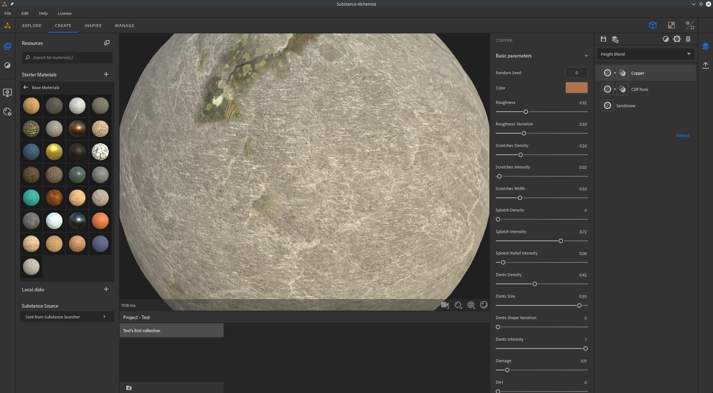
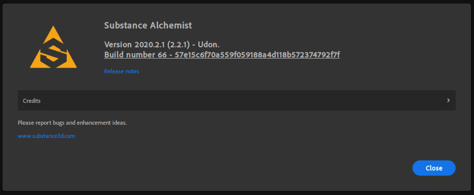

----

<a name="softmaker" />

## SoftMaker Office 2021 build S1018.0818

**Only for Linux x86_64**

Your new Office suite Linux.

[SoftMaker Office home site](https://www.softmaker.com/en/softmaker-office)

License key required: **NO**
```
After the patch, the program is fully functional.
```

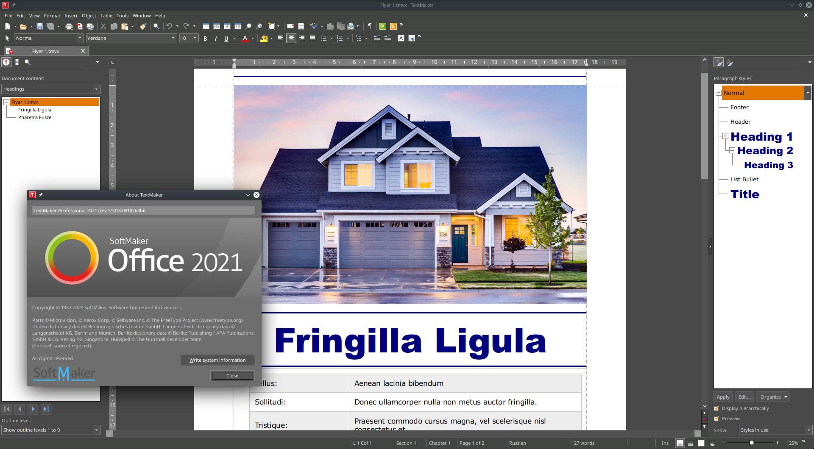


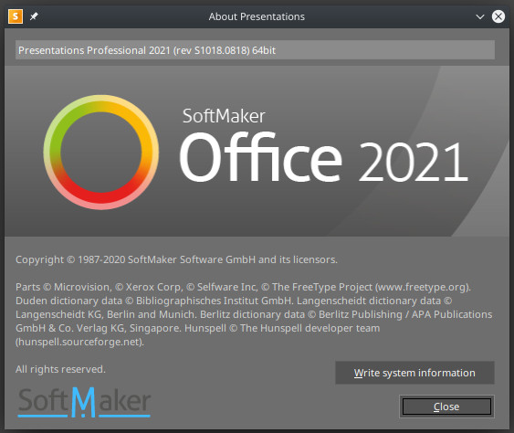

----

<a name="masterpdf" />

## Master PDF Editor 5.6.42

**For all version and Linux x86_64**

Master PDF Editor is straightforward, easy to use application for working with PDF documents equipped with powerful multi-purpose functionality. With Master PDF Editor you can easily view, create and modify PDF documents. The application enables you to merge several files into one, split a source document into multiple documents, and also to comment, sign and encrypt PDF files.

[Master PDF Editor home site](https://code-industry.net/masterpdfeditor/)

License key required: **NO**
```
After the patch, the program is fully functional.
```

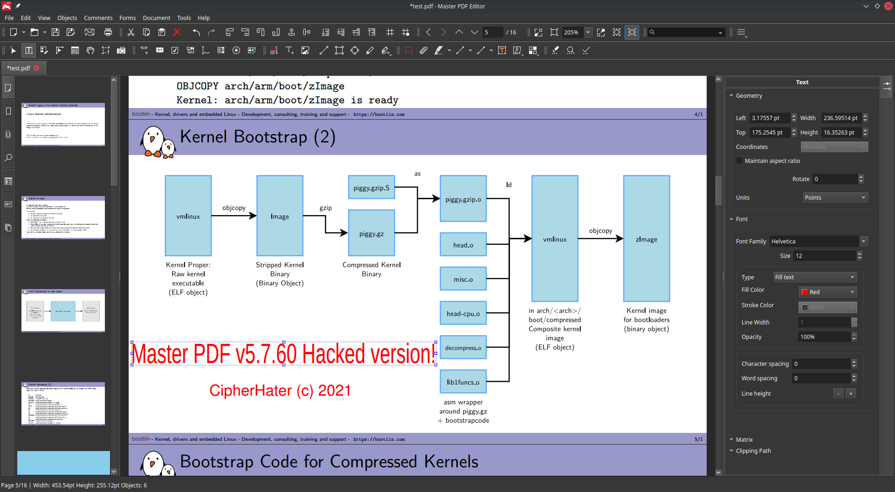
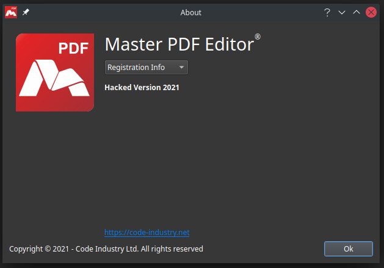

----

<a name="eagle" />

## Autodesk EAGLE Version 9.6.0

**Only for version 9.6.0 and Linux x86_64**

EAGLE is an electronic design automation (EDA) software. Enabling printed circuit board (PCB) designers to seamlessly connect schematic diagrams, component placement, PCB routing, and comprehensive library content.

[Autodesk EAGLE home site](https://www.autodesk.com/products/eagle/overview)

License key required: **YES**
```
After the patch, the program is fully functional.
```


----

<a name="varicad" />

## VariCAD 2020-1.12 (20191119)

**For all version and 2020-1.12 (20191119) and Linux x86_64**

VariCAD is compact, fast, easy to use, and provides everything necessary for mechanical design.
VariCAD is sold "fully loaded", including all features and functions, for one affordable price.

[VariCAD home site](https://www.varicad.com/en/home/)

License key required: **NO**
```
After the patch, the program is fully functional.
```


----

<a name="qcad2d" />

## QCAD-2D 3.25

**For all version and 3.25 and Linux x86_64**

QCAD is a free, open source application for computer aided drafting (CAD) in two dimensions (2D). With QCAD you can create technical drawings such as plans for buildings, interiors, mechanical parts or schematics and diagrams. QCAD works on Windows, macOS and Linux. The source code of QCAD is released under the GPL version 3 (GPLv3), a popular Open Source license.

[QCAD-2D home site](https://qcad.org/en/)

License key required: **NO**
```
After the patch, the program is fully functional.
```

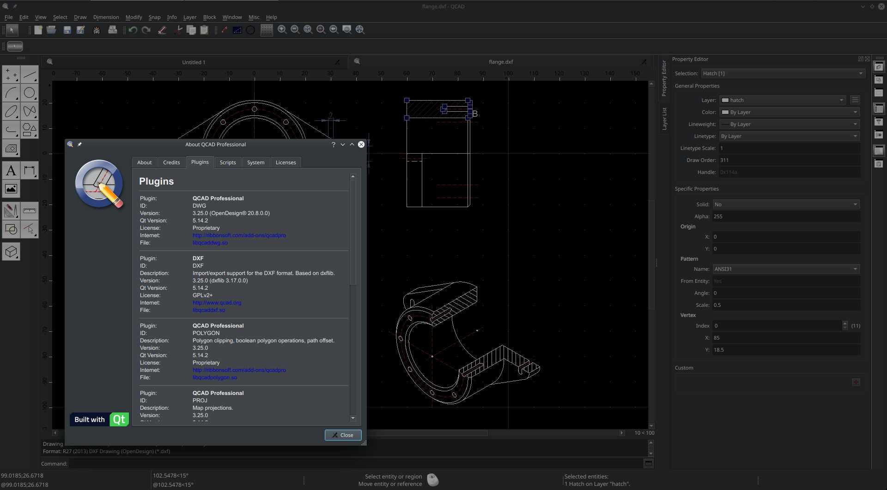
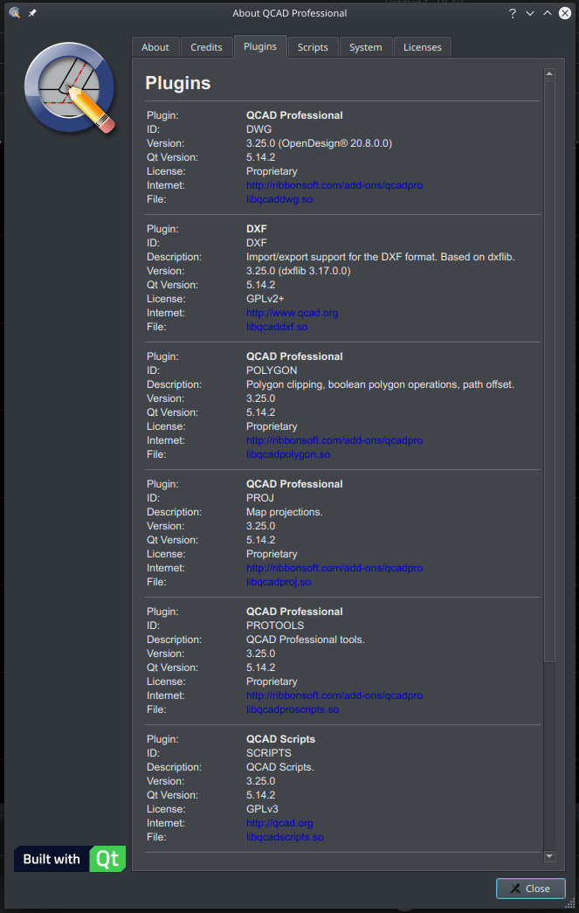


----

<a name="qcadcam" />

## QCAD/CAM 3.25

**For all version and 3.25 and Linux x86_64**

QCAD/CAM is QCAD Professional with a CAM (Computer-Aided Manufacturing) module. The QCAD/CAM software includes every tool and feature that QCAD Professional has - but in addition it also has some CAM specific tools to export drawings to machine readable file formats such as G-Code. Such files are usually used to control computer controlled machines (CNC) such as milling machines, engraving machines, LASER cutting machines, plasma cutting machines or water jet cutting machines.

[QCAD/CAM home site](https://qcad.org/en/products/qcad-cam)

License key required: **NO**
```
After the patch, the program is fully functional.
```

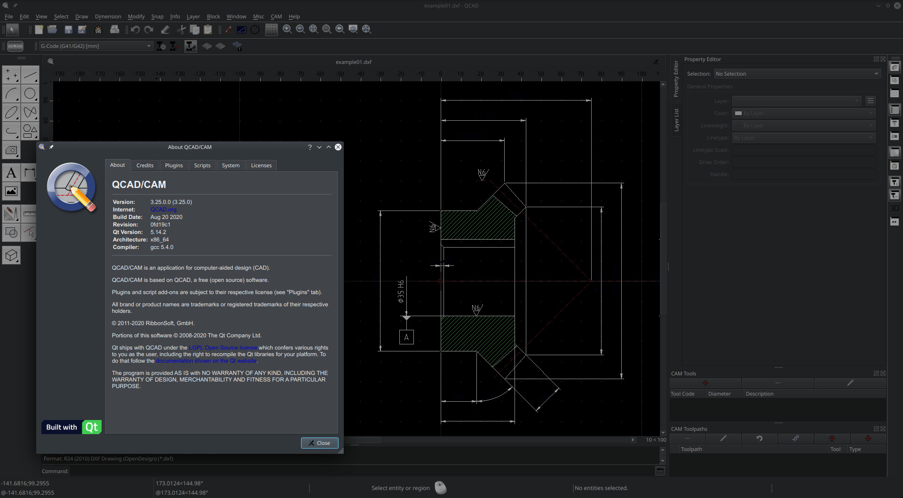


----

<a name="sublimetext" />

## Sublime Text 3

**For all builds and 3211 Linux x86_64**

SublimeText a sophisticated text editor for code, markup and prose.

[Sublime Text home site](https://www.sublimetext.com/)

License key required: **YES**
```
After the patch, the program is fully functional.
```


----

<a name="sublimemerge" />

## Sublime Merge

**For all builds and 2038 Linux x86_64**

SublimeMerge Git Client, done Sublime.

[Sublime Merge home site](https://www.sublimemerge.com/)

License key required: **YES**
```
After the patch, the program is fully functional.
```


----

<a name="vuescan" />

## VueScan 9 x64

**Only for version v9.7.46 and Linux x86_64**

VueScan is an application for scanning documents, photos, film, and slides.
VueScan supports over 6000 scanners from 42 manufacturers – even when there
isn’t a driver available from the manufacturer.

[VueScan home site](https://www.hamrick.com/)

License key required: **YES**
```
After the patch, the program is fully functional.
```

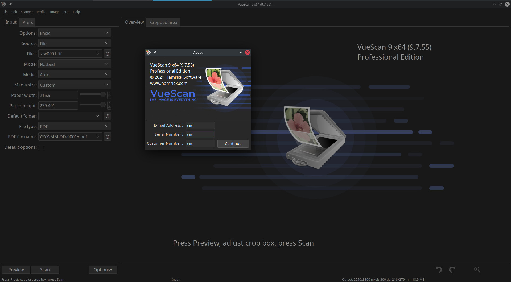
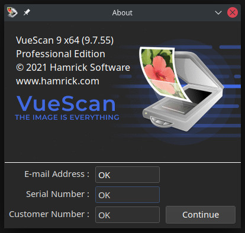

----

<a name="flexbv" />

## FlexBV x64

**Only for version R1060/R1115/R1150 and Linux x86_64**

FlexBV interlinks boardviews and schematics saving you the hassle of manually cross-referencing, to provide a smoother repair process, leaving you to keep your mind focused on finding the fault.

[FlexBV home site](https://pldaniels.com/flexbv/)

License key required: **NO**
```
After the patch, the program is fully functional.
```


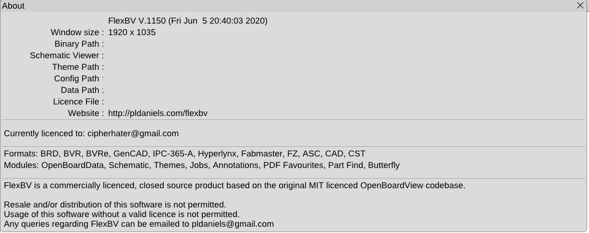

----

<a name="serviio" />

## Serviio v2.0 Pro

**Only for version v2.0 and Linux x86_64**

Serviio is a free media server. It allows you to stream your media files (music, video or images) to renderer devices (e.g. a TV set, Bluray player, games console or mobile phone) on your connected home network.

[Serviio home site](https://www.serviio.org/)

License key required: **NO**
```
After the patch, the program is fully functional.
```


----

<a name="3dcoat" />

## 3dCoat 4.8.20 + 3DCprinting 1.1.09 Unlimited

**For all version and Linux x86_64**

3DCoat is the one application that has all the tools you need to take your 3D idea from a block of digital clay all the way to a production ready, fully textured organic or hard surface model.

[3DCoat home site](https://3dcoat.com/)

License key required: **NO**
```
After the patch, the program is fully functional.
```


----

<a name="010editor" />


## 010 Editor 10.0.2

**For all version and Linux x86_64**

Professional Text Editor + World's Best Hex Editor.

[010 Editor home site](https://www.sweetscape.com/)

License key required: **YES**
```
After the patch, the program is fully functional.
```


----

<a name="mathematica" />


## Wolfram Mathematica 12.1.1

**For version 12+ and Linux x86_64**

For three decades, Mathematica has defined the state of the art in technical computing—and provided the principal computation environment for millions of innovators, educators, students, and others around the world.

[Mathematica home site](https://www.wolfram.com/mathematica/?source=nav)

License key required: **YES**
```
After the generate key with keygen, the program is fully functional.
```


----


## Donate

Bitcoin donations are being used to fund a fully monitored hacking project or help maintain one. We'll provide you with unmatched transparency and accountability of our work. Please join us!

[](https://en.cryptobadges.io/donate/3PY8prh5RLbuGtyBq4DCvP9xKVw7FZZkuR)


----

<center>
    <p>
        Copyright &copy; 2019-2020 CipherHater All rights reserved.
    </p>
</center>
